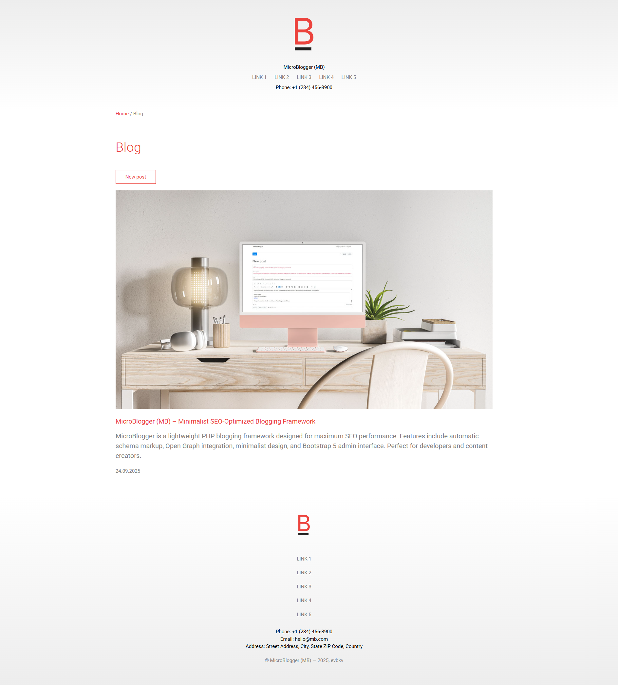
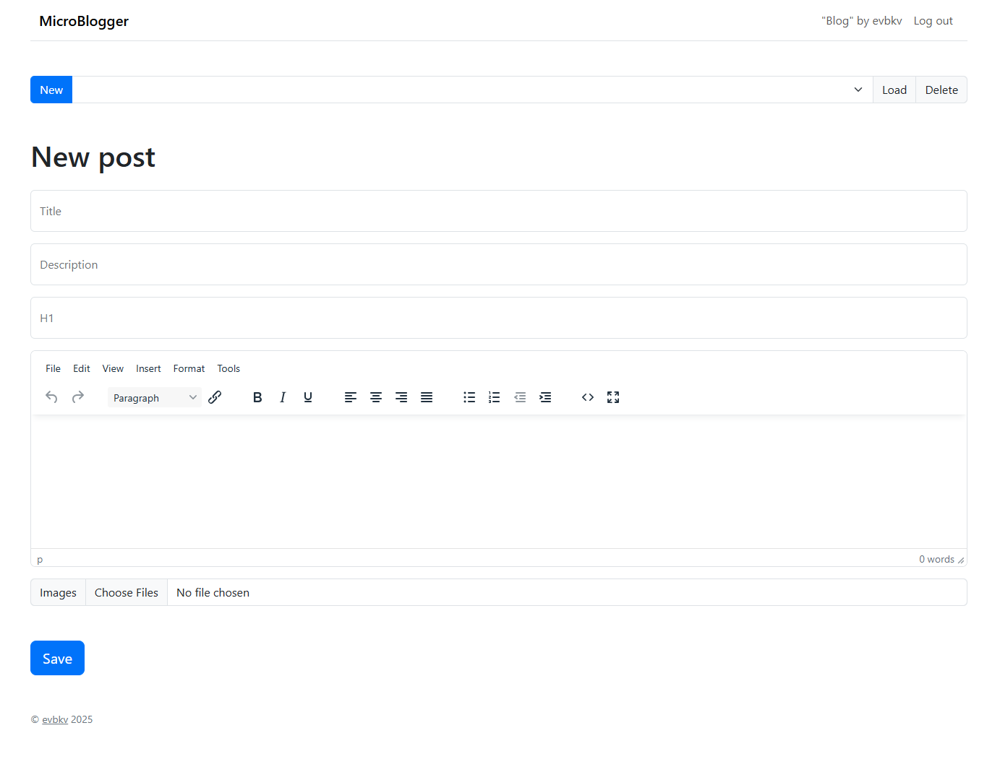

# MicroBlogger (MB) - Minimalist SEO-Optimized Blogging Framework

## Description

MicroBlogger (MB) is a lightweight, SEO-optimized blogging framework designed as an extension to the Landing Web Framework (LWF). Developed with search engine optimization as a primary focus, MB helps increase website presence in search engines through carefully implemented technical SEO features while maintaining a minimalist and user-friendly interface.

### Key Features

* **SEO-Optimized Structure**: Built-in [[schema.org]{.underline}](https://schema.org/) markup, Open Graph tags, Twitter Cards, and canonical URLs
* **Minimalist Design**: Clean, content-focused layout with optimal readability
* **Simple Administration**: Intuitive editor with Bootstrap 5 and TinyMCE integration
* **Automatic Sitemap Generation**: Dynamic sitemap.xml creation for better search engine indexing
* **Last Posts Widget**: Simple integration of recent blog posts into landing pages
* **Image Management**: Automated image handling with optimized file naming
* **Pagination System**: Efficient content organization for better user experience

### Technical Advantages

* **[[Schema.org]{.underline}](https://schema.org/) Rich Snippets**: Article, BreadcrumbList, and ImageObject structured data
* **Social Media Ready**: Comprehensive Open Graph and Twitter Card implementation
* **Performance Optimized**: Minimal codebase with efficient PHP execution
* **SEO-Friendly URLs**: Clean, semantic URL structure without unnecessary parameters
* **Automatic Meta Tags**: Dynamic title, description, and canonical URL generation
- **Embeddable Content**: Easy integration of blog content into existing websites

## Installation

### Requirements

* PHP 7.4 or higher
* Web server (Apache/Nginx) with mod_rewrite enabled
* File upload permissions for the /img/ directory

### Installation Steps

1.  **Download the Framework**

> bash
>
> git clone https://github.com/evbkv/mb.git

2.  **Upload to Web Server**

* Upload all files to your web server\'s document root or subdirectory

3.  **Configure Directory Permissions**

> bash
>
> chmod 755 img/
>
> chmod 644 \*.php

4.  **Verify Installation**

* Navigate to your domain in a web browser
* The blog index should load without errors

## Configure

### Basic Configuration

Edit mb/settings.php to customize your blog:

> php
> 
> \$AUTHOR_NAME = \'Your Name\'; *// Author display name*
> 
> \$AUTHOR_PASS = \'your_password\'; *// Admin password*
> 
> \$lang = \[\'en\', \'en_EN\'\]; *// Language settings*
> 
> \$blogTitle = \'Your Blog Title\'; *// Blog title*
> 
> \$indexPosts = 5; *// Posts per page*
> 
> \$homePage = \[\'Home\', \'https://yourdomain.com\'\]; *// Home link or ''*
> 
> \$lastPosts = 5; *// Recent posts count*

### Admin Access

1. Navigate to /editor/ in your browser
2. Use the password set in \$AUTHOR_PASS
3. Create, edit, and manage blog posts through the intuitive interface

### SEO Configuration

* Update \$blogTitle and author information for proper meta tags
* Configure \$homePage for correct breadcrumb navigation
* The system automatically generates optimized URLs and meta descriptions

### Last Posts Integration

Easily embed recent blog posts into your landing pages:

> php
> 
> include 'path/to/mb/lastposts.php';

The widget automatically displays the latest posts with titles, descriptions, and publication dates.

## Roadmap

### Planned Features

* Advanced image optimization
* Multi-language support

### Current Version Features

* Complete SEO optimization suite
* Responsive mobile design
* Bootstrap 5 admin interface
* TinyMCE rich text editor
* Automatic sitemap generation
* Last Posts Widget
* Image management system
* Pagination system

## Screenshot

## Author

[Evgenii Bykov](https://github.com/evbkv)

## License

This project is licensed under the GNU General Public License v3.0 - see
the [LICENSE](https://github.com/evbkv/mb/LICENSE.txt) file for details.

### Key License Points:

* Free to use, modify, and distribute
* Requires attribution to original author
* Derivative works must use same license
* Commercial use permitted with compliance